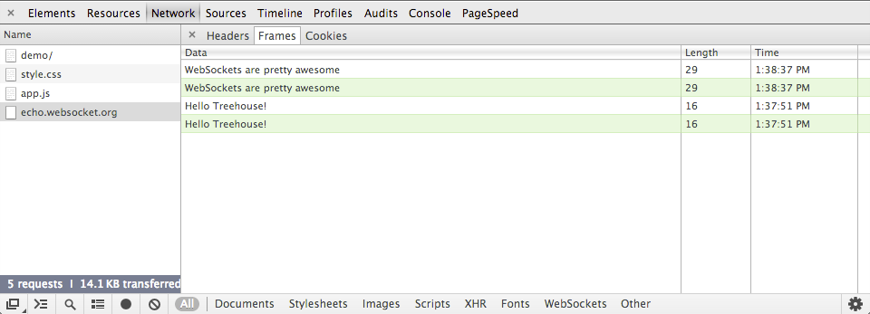

## Web Sockets

### A Brief History of Real-Time Web Applications

The web was built around the idea that a client’s job is to request data from a server, and a server’s job is to fulfill those requests. This paradigm went unchallenged for a number of years but with the introduction of AJAX around 2005 many people started to explore the possibilities of making connections between a client and server bidirectional.

Web applications had grown up a lot and were now consuming more data than ever before. The biggest thing holding them back was the traditional HTTP model of client initiated transactions. To overcome this a number of different strategies were devised to allow servers to push data to the client. One of the most popular of these strategies was long-polling. This involves keeping an HTTP connection open until the server has some data to push down to the client.

The problem with all of these solutions is that they carry the overhead of HTTP. Every time you make an HTTP request a bunch of headers and cookie data are transferred to the server. This can add up to a reasonably large amount of data that needs to be transferred, which in turn increases latency. If you’re building something like a browser-based game, reducing latency is crucial to keeping things running smoothly. The worst part of this is that a lot of these headers and cookies aren’t actually needed to fulfil the client’s request.

What we really need is a way of creating a persistent, low latency connection that can support transactions initiated by either the client or server. This is exactly what WebSockets provide and in this post you are going to learn all about how to use them in your own applications.

### How WebSockets Work

WebSockets provide a persistent connection between a client and server that both parties can use to start sending data at any time.

The client establishes a WebSocket connection through a process known as the WebSocket handshake. This process starts with the client sending a regular HTTP request to the server. An `Upgrade` header is included in this request that informs the server that the client wishes to establish a WebSocket connection.

Here is a simplified example of the initial request headers.

```
GET ws://websocket.example.com/ HTTP/1.1
Origin: http://example.com
Connection: Upgrade
Host: websocket.example.com
Upgrade: websocket
```

**Note:** WebSocket URLs use the `ws` scheme. There is also `wss` for secure WebSocket connections which is the equivalent of `HTTPS`.

If the server supports the WebSocket protocol, it agrees to the upgrade and communicates this through an `Upgrade` header in the response.

```
HTTP/1.1 101 WebSocket Protocol Handshake
Date: Wed, 16 Oct 2013 10:07:34 GMT
Connection: Upgrade
Upgrade: WebSocket
```

Now that the handshake is complete the initial HTTP connection is replaced by a WebSocket connection that uses the same underlying TCP/IP connection. At this point either party can starting sending data.

With WebSockets you can transfer as much data as you like without incurring the overhead associated with traditional HTTP requests. Data is transferred through a WebSocket as messages, each of which consists of one or more frames containing the data you are sending (the payload). In order to ensure the message can be properly reconstructed when it reaches the client each frame is prefixed with 4-12 bytes of data about the payload. Using this frame-based messaging system helps to reduce the amount of non-payload data that is transferred, leading to significant reductions in latency.

### Example

**index.html**

```html
<!DOCTYPE html>
<html lang="en">
<head>
  <meta charset="utf-8">
  <title>WebSockets Demo</title>
  <link rel="stylesheet" href="style.css">
</head>
<body>
  <div class="page-wrapper">
    <h1>WebSockets Demo</h1>

    <div class="status">Connecting...</div>

    <ul class="messages"></ul>

    <form class="message-form" action="#" method="post">
      <textarea class="message" placeholder="Write your message here..." required></textarea>
      <button type="submit">Send Message</button>
      <button type="button" class="close">Close Connection</button>
    </form>
  </div>

  <script src="app.js"></script>
</body>
</html>
```

**app.js**

```javascript
window.onload = () => {

  // Get references to elements on the page.
  const form = document.querySelector('.message-form');
  const messageField = document.querySelector('.message');
  const messagesList = document.querySelector('.messages');
  const socketStatus = document.querySelector('.status');
  const closeBtn = document.querySelector('.close');

  // The rest of the code in this tutorial will go here...
};
```

### Opening Connections

Creating WebSocket connections is really simple. All you have to do is call the `WebSocket` constructor and pass in the URL of your server.

```javascript
// Create a new WebSocket.
const socket = new WebSocket('ws://echo.websocket.org');
```

Once the connection has been established the `open` event will be fired on your WebSocket instance.

For your demo application you are going to add an event listener that will update the status `<div>` with a message to show the user that a connection has been established.

```javascript
// Show a connected message when the WebSocket is opened.
socket.onopen = (event) => {
  socketStatus.innerHTML = `Connected to: ${event.currentTarget.URL}`;
  socketStatus.className = 'open';
};
```

### Handling Errors

You can handle any errors that occur by listening out for the `error` event.

```javascript
// Handle any errors that occur.
socket.onerror = (error) => {
  console.log(`WebSocket Error: ${error}`);
};
```

### Sending Messages

To send a message through the WebSocket connection you call the `send()` method on your `WebSocket` instance; passing in the data you want to transfer.

```javascript
socket.send(data);
```

You can send both text and binary data through a WebSocket.

In our application we need to send the contents of the textarea to the server when the form is submitted. To do this we first need to set up an event listener on the form.

```javascript
// Send a message when the form is submitted.
form.onsubmit = (e) => {
  e.preventDefault();

  // Retrieve the message from the textarea.
  const message = messageField.value;

  // Send the message through the WebSocket.
  socket.send(message);

  // Add the message to the messages list.
  messagesList.innerHTML += `<li class="sent"><span>Sent:</span> ${message}</li>`;

  // Clear out the message field.
  messageField.value = '';

  return false;
};
```

When the form is submitted this code will retrieve the message from the `messageField` and send it through the WebSocket. The message is then added to the `messagesList` and displayed on the screen. To finish up, the value of `messageField` is reset ready for the user to type in a new message.

### Receiving Messages

When a message is received the `message` event is fired. This event includes a property called `data` that can be used to access the contents of the message.

For our application we need to create an event listener that will be fired when a new message is received. Our code should then retrieve the message from the event and display it in the `messagesList`.

```javascript
// Handle messages sent by the server.
socket.onmessage = (event) => {
  const message = event.data;
  messagesList.innerHTML += `<li class="received"><span>Received:</span> ${message}</li>`;
};
```

### Closing Connections

Once we're done with your WebSocket you can terminate the connection using the `close()` method.

```javascript
socket.close();
```

After the connection has been closed the browser will fire a `close` event. Attaching an event listener to the `close` event allows you to perform any clean up that you might need to do.

For our app, we will want to update the connection status when the connection is closed.

```javascript
// Show a disconnected message when the WebSocket is closed.
socket.onclose = (event) => {
  socketStatus.innerHTML = 'Disconnected from WebSocket.';
  socketStatus.className = 'closed';
};
```

Finally, we need to add an event listener that will be fired when the 'Close Connection' button is clicked. This should call `close()` on the WebSocket.

```javascript
// Close the WebSocket connection when the close button is clicked.
closeBtn.onclick = (e) => {
  e.preventDefault();

  // Close the WebSocket.
  socket.close();

  return false;
};
```

### Monitoring WebSocket Traffic with the Chrome Dev Tools



The developer tools in Google Chrome include a feature for monitoring traffic through a WebSocket. You can access this tool by following these steps:

- Open up the Developer Tools.
- Switch to the `Network` tab.
- Click on the entry for your WebSocket connection.
- Switch to the `Frames` tab.

### WebSockets on the Server

There are plenty of libraries for building a WebSocket server. One of the most popular is [socket.io](https://socket.io/), a Node.JS library that provides cross-browser fallbacks so you can confidently use WebSockets in your applications today.

### References

- [MDN](https://developer.mozilla.org/en-US/docs/Web/API/WebSockets_API)
- [Wiki](https://en.wikipedia.org/wiki/WebSocket)
- [HTML5 Rocks](https://www.html5rocks.com/en/tutorials/websockets/basics/)
- [Team Treehouse](http://blog.teamtreehouse.com/an-introduction-to-websockets)
