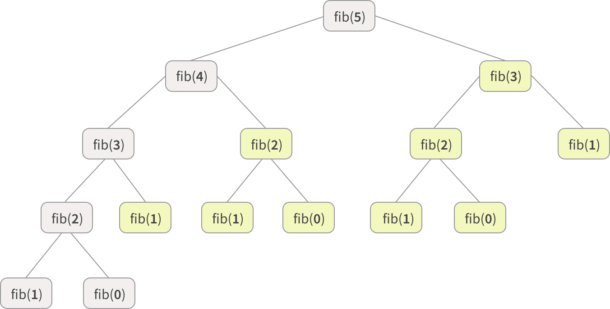
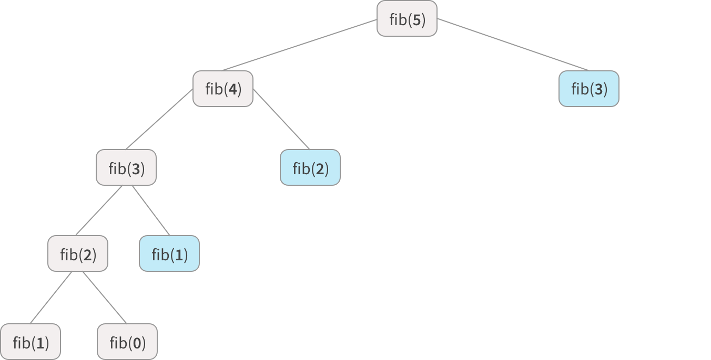

## Dynamic Programming

Dynamic programming is a method for solving complex problems by first solving simpler overlapping subproblems building up to solve the larger problem. Ideally, we use a memory-based data structure to store solutions to already solved subproblems as to not repeat work, we call this "memoization".

Dynamic programming algorithms are often used for **optimization**. That is, they combine their solutions to give the **best solution** for the given problem. In addition to finding optimal solutions to some problem, dynamic programming can also be used for counting the **number of solutions**, for example counting the number of ways a certain amount of change can be made from a given collection of coins.

In comparison, [greedy algorithms](/assets/greedy/_docs/index.md) do not guarantee an optimal, 'best' solution. Instead, they pick the locally optimal choice in a sequence of steps for a fast overall solution, but not necessarily the 'best'. Greedy algorithms give us **fast 'close to optimal' solutions** to NP-Complete problems, like the traveling salesman problem, which have no known optimal solution. Some greedy algorithms, however, are proven to lead to the optimal solution, such as Prim's for minimum spanning trees.

It's also important to note that a problem must have **overlapping sub-problems** to be applicable for solving through dynamic programming. Problems that can be solved by combining optimal solutions to **non-overlapping sub-problems**, use a strategy called ["divide and conquer"](/assets/sort_and_searching/_docs/index.md) instead, such as merge sort and binary search.

### Overlapping Subproblems

Overlapping sub-problems means that the space of sub-problems must be small, that is, any recursive algorithm solving the problem should solve the same sub-problems over and over, rather than generating new sub-problems.

As an example, let's look at the fibonacci sequence (the series where each number is the sum of the two previous ones, 0, 1, 1, 2, 3, 5, 8...).

If we wanted to compute the nth fibonacci number, we could use this simple recursive algorithm:

```javascript
function fib(n) {
  if (n === 0 || n === 1) {
    return n;
  }

  return fib(n - 1) + fib(n - 2);
}
```

We'd call fib(n - 1) and fib(n - 2) **subproblems** of fib(n).

Now let's look at what happens when we call fib(5):

<p align="center">

</p>

Our function ends up recursively calling fib(2) **three times**. So the problem of finding the nth fibonacci number has overlapping subproblems.

Even though the total number of sub-problems is actually small, we end up solving the same problems over and over if we adopt a naive recursive solution such as this. In our above example, you can see recursive functions marked in yellow have already been solved. Dynamic programming takes account of this fact and solves each sub-problem only once.

This can be achieved in either of two ways: **top-down (with memoization)**; or **bottom-up**.

### Top-Down and Memoization

This is the direct fall-out of the recursive formulation of any problem. If the solution to any problem can be formulated recursively using the solution to its sub-problems, and if its sub-problems are overlapping.

This approach builds up a **call stack** of size O(n), which makes our total memory cost O(n). This makes it vulnerable to a **stack overflow error**, where the call stack gets too big and runs out of space.

To help address this, we can easily memoize or store the solutions to the sub-problems, usually in an object. Whenever we attempt to solve a new sub-problem, we first check the storage to see if it is already solved. If a solution has been recorded, we can use it directly, otherwise we solve the sub-problem and add its solution to storage.

Let's continue with the above example.

To avoid the duplicate work caused by the branching, we can wrap the function in a class that stores an instance variable `this.memo` that maps inputs to outputs. Then we simply:

1. Check `this.memo` to see if we can avoid computing the answer for any given input, and
2. Save the results of any calculations to `this.memo`.

```javascript
class Fibber {
  constructor() {
    this.memo = {};
  }

  fib(n) {
    // edge case
    if (n < 0) {
      throw new Error('Index was negative. No such thing as a negative index in a series.');

    // base cases
    } else if (n === 0 || n === 1) {
      return n;
    }

    // see if we've already calculated this
    if (this.memo.hasOwnProperty(n)) {
      return this.memo[n];
    }

    let result = this.fib(n - 1) + this.fib(n - 2);

    // memoize
    this.memo[n] = result;

    return result;
  }
}
```

Now in our recurrence tree, no node appears more than twice and we save a bunch of calls. We can see once we hit a memoized value we stop recursing on that branch, these are marked in blue. This is much better.

<p align="center">

</p>

Memoization is a common strategy for dynamic programming problems but it still has limitations. Going **bottom-up** is usually a cleaner and more efficient approach which avoids recursion, saving the **memory cost** that recursion and memoization incurs.

> Some compilers and interpreters will do what's called **tail call optimization** (TCO), where it can optimize some recursive functions to avoid building up a tall call stack. The JavaScript spec recently allowed TCO in ES6

### Bottom-Up

A bottom-up algorithm "starts from the beginning", while a recursive (top-down) algorithm often "starts from the end and works backwards". Going bottom-up  means solving the sub-problems first and using their solutions to build-on and arrive at solutions to bigger sub-problems. This is also usually done in a **tabular** form by iteratively generating solutions to bigger and bigger sub-problems by using the solutions to small sub-problems.

Let's continue with our Fibonacci example.

```javascript
function fib(n) {
  let result = 1;
  for (let i = 1; i <= n; i += 1) {
    result *= i;
  }

  return result;
}
```

This approach uses O(1) space (O(n) time.

### Dynamic Programming Problems

<table>
  <!-- header -->
  <tr>
    <th>Question</th>
    <th>Difficulty</th>
    <th>Tags</th>
    <th>References</th>
    <th>Tested</th>
  </tr>

  <!-- entries -->
  <tr>
    <td><a href="../questions/wiggle_sequence/wiggle_sequence.js">Wiggle Sequence</a></td>
    <td>Medium</td>
    <td></td>
    <td>LeetCode #376</td>
    <td>:thumbsup:</td>
  </tr>

  <tr>
    <td><a href="../questions/making_change/making_change.js">Making Change</a></td>
    <td>Medium</td>
    <td></td>
    <td>LeetCode #322</td>
    <td>:thumbsup:</td>
  </tr>

  <tr>
    <td><a href="../questions/house_robber/house_robber.js">House Robber</a></td>
    <td>Easy</td>
    <td></td>
    <td>LeetCode #198</td>
    <td>:thumbsup:</td>
  </tr>

  <tr>
    <td><a href="../questions/cake_thief/cake_thief.js">Cake Thief</a></td>
    <td>Medium</td>
    <td>Bottom Up, Unbounded Knapsack, Classic</td>
    <td></td>
    <td>:thumbsup:</td>
  </tr>

</table>

### Resources

- [ES6 Tail Calls](http://benignbemine.github.io/2015/07/19/es6-tail-calls/)


