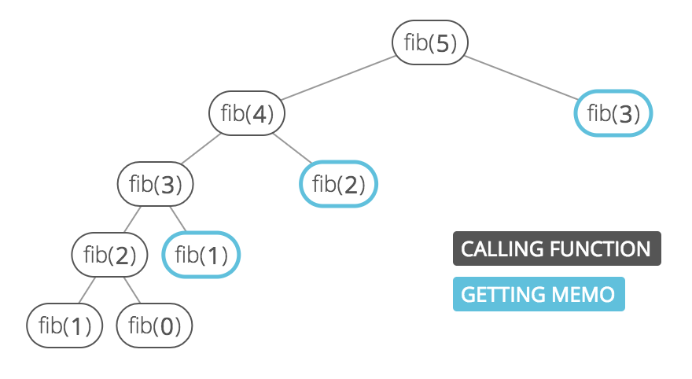

## Memoization

**Memoization** ensures that a function doesn't run for the same inputs more than once by keeping a record of the results for given inputs (usually in an object).

For example, a simple recursive function for computing the nth fibonacci number:

```javascript
function fibRecursive(n) {
  if (n === 0 || n === 1) {
    return n;
  }

  console.log('computing fibRecursive(' + n + ')');
  return fibRecursive(n - 1) + fibRecursive(n - 2);
}
```

Will run on the same inputs multiple times:

```
❯ fibRecursive(8)
computing fibRecursive(8)
computing fibRecursive(7)
computing fibRecursive(6)
computing fibRecursive(5)
computing fibRecursive(4)
computing fibRecursive(3)
computing fibRecursive(2)
computing fibRecursive(2)
computing fibRecursive(3)
computing fibRecursive(2)
computing fibRecursive(4)
computing fibRecursive(3)
computing fibRecursive(2)
computing fibRecursive(2)
computing fibRecursive(5)
computing fibRecursive(4)
computing fibRecursive(3)
computing fibRecursive(2)
computing fibRecursive(2)
computing fibRecursive(3)
computing fibRecursive(2)
computing fibRecursive(6)
computing fibRecursive(5)
computing fibRecursive(4)
computing fibRecursive(3)
computing fibRecursive(2)
computing fibRecursive(2)
computing fibRecursive(3)
computing fibRecursive(2)
computing fibRecursive(4)
computing fibRecursive(3)
computing fibRecursive(2)
computing fibRecursive(2)
❮ 21
```

We can imagine the recursive calls of this function as a tree, where the two children of a node are the two recursive calls it makes. We can see that the tree quickly branches out of control:

<p align="center">

<p>

To avoid the duplicate work caused by the branching, we can wrap the function in a class that stores an instance variable `this.memo` that maps inputs to outputs. Then we simply:

1. Check `this.memo` to see if we can avoid computing the answer for any given input, and
2. Save the results of any calculations to `this.memo`.

```javascript
function Fibber() {
  this.memo = {};
}

Fibber.prototype.fib = function(n) {

  // edge case
  if (n < 0) {
    throw new Error('Index was negative. No such thing as a negative index in a series.');

  // base cases
  } else if (n === 0 || n === 1) {
    return n;
  }

  // see if we've already calculated this
  if (this.memo.hasOwnProperty(n)) {
    console.log('grabbing memo[' + n + ']');
    return this.memo[n];
  }

  console.log('computing fib(' + n + ')');
  let result = this.fib(n - 1) + this.fib(n - 2);

  // memoize
  this.memo[n] = result;

  return result;
}
```

We save a bunch of calls by checking the memo:

```
❯ Fibber().fib(8)
computing fib(8)
computing fib(7)
computing fib(6)
computing fib(5)
computing fib(4)
computing fib(3)
computing fib(2)
grabbing memo[2]
grabbing memo[3]
grabbing memo[4]
grabbing memo[5]
grabbing memo[6]
❯ 21
```

Now in our recurrence tree, no node appears more than twice:

<p align="center">

<p>

Memoization is a common strategy for **dynamic programming** problems, which are problems where the solution is composed of solutions to the same problem with smaller inputs (as with the fibonacci problem, above). The other common strategy for dynamic programming problems is **going bottom-up**, which is usually cleaner and often more efficient.
